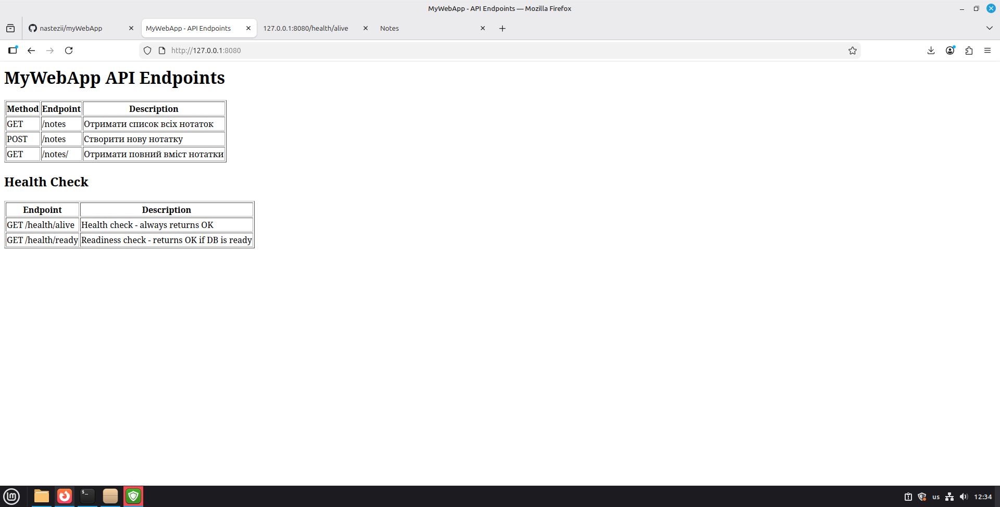
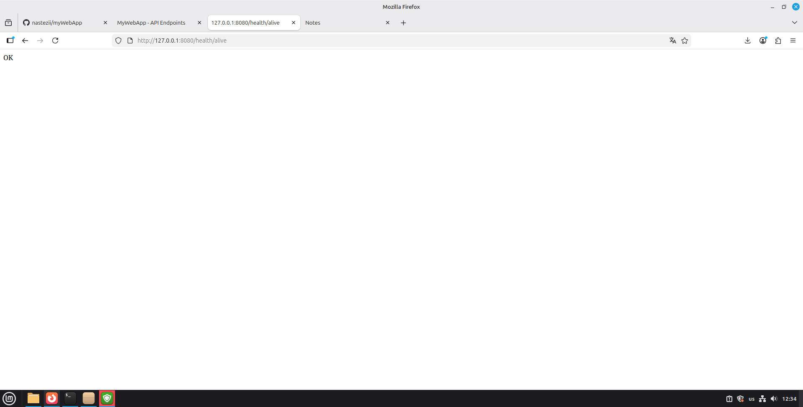
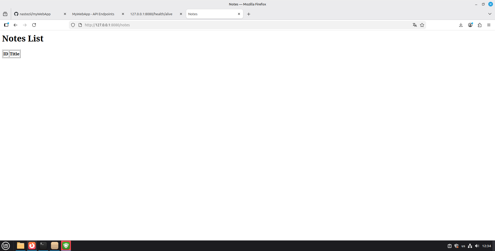

# MyWebApp — Лабораторна робота №1

## Загальна інформація

У межах лабораторної роботи було розроблено веб-застосунок на Python, який реалізує REST API та працює з базою даних.

Застосунок розгортається на Linux і підтримує роботу через HTTP.

---

## Варіант

N = 30

Обчислення:

V2 = (30 % 2) + 1 = 1
V3 = (30 % 3) + 1 = 1
V5 = (30 % 5) + 1 = 1

Отже:

* тип застосунку: **Notes Service**
* база даних: **MariaDB**
* порт: **8080**

---

## Особливість реалізації

Хоча за варіантом потрібен тільки Notes Service, у роботі реалізовано універсальний застосунок, який підтримує:

* Notes Service
* Task Tracker
* Simple Inventory

Тип сервісу задається параметром:

```bash
python3 app.py --app-type notes
```

У межах лабораторної використовується режим **notes**.

---

## Архітектура

Застосунок складається з:

* Flask веб-сервісу
* класу `DatabaseManager` для роботи з БД
* сервісів:

  * NotesService
  * TaskTracker
  * SimpleInventory

Усі компоненти працюють в межах однієї машини.

---

## Реалізований функціонал

### Notes Service

Ендпоінти:

* GET /notes — список нотаток (id, title)
* POST /notes — створення нотатки
* GET /notes/<id> — повна інформація

Структура нотатки:

* id
* title
* content
* created_at

---

## Додатково реалізовано

Окрім вимог варіанту:

### 1. Health Check

* `/health/alive` — завжди повертає OK
* `/health/ready` — перевіряє підключення до БД

---

### 2. Підтримка форматів

В залежності від заголовка `Accept`:

* `application/json` → JSON
* `text/html` → HTML сторінка

---

### 3. Кореневий ендпоінт

`/` повертає HTML зі списком усіх API.

---

### 4. Робота з базою даних

Реалізовано окремий клас `DatabaseManager`, який:

* підключається до БД
* виконує запити
* перевіряє з'єднання

---

### 5. Підтримка різних БД

* PostgreSQL
* MariaDB / MySQL

Тип визначається автоматично.

---

### 6. Міграції

Є окремий скрипт:

```bash
python3 migrate.py --db-type mysql --app-type notes
```

Створює таблиці та індекси.

---

### 7. Обробка помилок

* 400 — некоректні дані
* 404 — не знайдено
* 500 — помилка БД

---

## Запуск

```bash
python3 app.py
```

Після запуску:

http://127.0.0.1:8080

---

## Приклади роботи

### Головна сторінка



Відображає список усіх доступних ендпоінтів застосунку та health-check.

---

### Health check



Ендпоінти `/health/alive` та `/health/ready` повертають статус сервісу.

---

### Notes список



Список нотаток відображається у вигляді HTML-таблиці.
Підтримується також JSON-формат.

---

## База даних

```sql
CREATE TABLE notes (
    id INT AUTO_INCREMENT PRIMARY KEY,
    title VARCHAR(255) NOT NULL,
    content TEXT,
    created_at TIMESTAMP DEFAULT CURRENT_TIMESTAMP
);
```

---

## Залежності

* flask
* flask-cors
* psycopg2-binary
* PyMySQL
* python-dotenv
* gunicorn

---

## Висновок

Було реалізовано веб-застосунок, який:

* працює з базою даних
* підтримує REST API
* повертає HTML та JSON
* має health-check
* підтримує кілька типів сервісів
* має скрипт міграції
